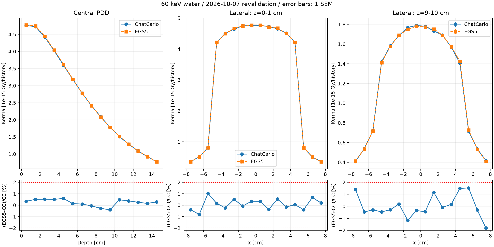

# 現行ChatCarlo — BSF_w・PDD/OCR再検証（2026-10-07）

対象: `9a91953` のproduction NumPy輸送。物理・輸送・断面積実装の変更なし。
条件・判定は[事前登録](PREREGISTRATION.md)で実行前に固定。
以下の±はすべて1 SEM。線量はmAs未校正の **Gy/history**。

独立監査（A/B/C）は **条件付き合格**。条件は従来基準の1不合格・4統計不足と
Rayleigh fit警告の未定量な影響を提示に残すこと。重大所見なし。
数値の合否と監査判定は別であり、全47ビンの物理合格を意味しない。
判定・所見表・独立検証・未確認事項の原文は[監査報告書](AUDIT.md)。

## 結果

**BSF_wは従来基準で合格。PDD中心軸15ビンは全合格。側方分布を含む47ビンでは
従来基準42合格・1不合格・4統計不足で、全ビン合格とは判定しない。**
事前登録した多重比較補助判定では、統計適格43ビンすべて合格。
これを従来基準の代わりに使って不合格を消すことはしない。

| 量 | ChatCarlo | EGS5 | 相対差(EGS5−CC)/CC | z | 従来判定 |
|---|---:|---:|---:|---:|---|
| BSF_w（水薄層基準） | 1.359380 ± 0.002147 | 1.364516 ± 0.005778 | +0.3778% | 0.8332 | 合格 |
| 表面PDD、z=0..1 cm | (4.760555 ± 0.009979)×10⁻¹⁵ Gy/history | (4.776729 ± 0.008095)×10⁻¹⁵ Gy/history | +0.3398% | 1.259 | 合格 |
| OCR、x=4..5、z=9..10 cm | (1.406248 ± 0.007734)×10⁻¹⁵ Gy/history | (1.427251 ± 0.006243)×10⁻¹⁵ Gy/history | +1.4936% | 2.1130 | 不合格（2σ超） |

BSF_wの合成相対SEMは0.45195%（<1%）。従来の自由空気基準BSFとは定義が異なる。
PDD/OCRの47ビン単純平均相対差は **+0.10813%**、中心軸15ビン平均は+0.23351%、
側方32ビン平均は+0.04936%。全47ビンの最大絶対相対差は1.81412%、最大zは2.11301。
平均値は空間積分でも、相関を考慮した系統差の検定でもない。

| 群 | 従来2σ・2%基準 合格 | 不合格 | 両コードSEM<1%未達 |
|---|---:|---:|---:|
| 中心軸PDD（15） | 15 | 0 | 0 |
| 表層OCR（16） | 14 | 0 | 2 |
| 深部OCR（16） | 13 | 1 | 2 |
| 合計（47） | 42 | 1 | 4 |

統計不足の4ビンは浅部/深部OCRのx=-8..-7、7..8 cm。
ChatCarlo相対SEMは1.101〜1.123%、EGS5は0.808〜0.880%。
これらを合格と数えない。本計算後のhistory増加・seed選び直しはしていない。
補助判定は全47比較でBonferroni両側family-wise α=.05、z<3.27307836404、相対差<2%。
相関のあるビンを独立としてχ²検定はしていない。単一の2σ超過を実装バグと断定もしない。

全47ビンの値・SEM・差・z・両判定は[comparison.csv](comparison.csv)、
集計の機械可読結果と入力SHA256は[comparison.json](comparison.json)。



## 独立解析アンカー（散乱込み線量の厳密解ではない）

xraylibを直接呼び出した60 keV H2Oのμ=0.20590105143 cm⁻¹と、
同梱NIST XAAMDI CSVの60 keV μen/ρ=0.03190 cm²/gで計算。
ChatCarloの補間断面積による解析参照（runner内）と、この直接参照を区別する。

| 対象 | 独立解析参照 | ChatCarlo | EGS5 |
|---|---|---|---|
| 水20 cmの一次線透過率 | exp(−μ×20)=0.01627669370 | 0.0162314 ± 0.00005651184（0.8015σ） | 今回のcollision線量コードでは一次線数を採点していない |
| 表面PDD一次線成分 | 2.771458492×10⁻¹⁵ Gy/history | 散乱込み4.760554533×10⁻¹⁵ Gy/history | 散乱込み4.776729417×10⁻¹⁵ Gy/history |
| BSF_w | 散乱込み比の厳密解析解なし | 1.359380 ± 0.002147 | 1.364516 ± 0.005778 |

表面PDDは両コードとも一次線成分より大きく、散乱増加の桁は整合する。
一次線透過率はChatCarloの世界境界までの測定で、ごく短い入射/出口airも含む。
入射air gap0.0001 cmの減弱はproduction係数で2.2591×10⁻⁸、出口正面air0.01 cmは
約2.2591×10⁻⁶。散乱光子のair全経路長を0.01 cmで一律に上限化してはいない。
同じ条件の厳密な文献BSF_wは今回取得しておらず、従来BSF文献を合否に流用しない。

## 条件・再現性・収支

- 60 keV、10×10 cm²平行ビーム、水30×30×20 cm、密度1.000 g/cm³。
  BSF薄層は30×30×0.2 cm、中央10×10×0.2 cmを採点。
- ChatCarlo: BSF500,000史ずつ（seed1/2）、PDD5,000,000史（seed1）。
  EGS5: BSF8,000,000史ずつ（seed6/7）、PDD100,000,000史（seed1）。
- EGS5はIBOUND=1・INCOH=1・IRAYL=1、全水領域incohr/iraylr=1。
  ECUT1.5 MeVで電子局所付与、AP/PCUT1 keV、Dopplerなし、低Z蛍光は局所吸収。
- ChatCarloの各BSF幾何とPDDの10,000史同一seed反復は完全一致。
  EGS5 PDD10,000史同一seed反復も全採点行が完全一致。
- ChatCarloの吸収+脱出=全履歴、エネルギー収支相対残差は薄層0、
  BSF分子−2.48×10⁻¹⁶、PDD−1.99×10⁻¹⁶。
- 全本計算で水の10 keV未満segment・scoreは0。PDD最低segment energyは17.5689 keV。
  この実行での低エネルギーカットオフ影響を示す所見であり、他条件への一般保証ではない。
- 外気中の相互作用は薄層1/500,000史、BSF分子3/500,000史、PDD16/5,000,000史。
  空気を真空と完全同一とは扱わない。相互作用数だけから線量影響の上限は断定しない。

過去の密度1.001、PCUT10 keV、bbox50 cm条件と今回の条件は異なる。
過去結果との差を一要因の効果と断定しない。旧JSON/CSV/PNG/logは保存した。
今回の結果が保証するのはこの60 keV水ベンチマークであり、患者・遮蔽・多色線源全般ではない。

## 警告・未確認事項

PEGS5は全成功runで電子fit150区間、Rayleigh分布fit100区間の
`allocated intervals insufficient`（既定相対精度1%未達）を出した。
電子は局所付与設定なので電子輸送fit警告の影響は今回の輸送に入らない。
**Rayleighの角度分布fit警告の線量への影響は未定量で、無害と断定しない。**
光子輸送断面積fitは69区間で成功、INCOH設定の`OPTION NOT REQUESTED`警告はない。
全成功runのbuild/run exitは0。最初の計装用変数名誤りによるコンパイル失敗は修正後に
本計算を実行し、失敗ログもEGS5成果物に残した。

今回の事前登録は実行前/後のSHA256一致でセッション内固定を検証した。
事前commitはしていないため、Gitコミット順による事前登録の証跡にはなっていない。
1件の2σ超過と4件の統計不足、Rayleigh fit警告の影響定量が今後の確認候補。
比較基準の変更や物理修正をこの作業に混ぜていない。
EGS5側は局所付与量のみを保存し、脱出エネルギーを採点していないため、
全入射エネルギーに対する吸収＋脱出収支は今回未確認。

## 再実行と成果物

リポジトリルートから（Pythonはプロジェクトvenv）:

```bash
PYTHONPATH=. .venv/bin/python docs/egs5_crosscheck/revalidation_2026_10_07/run_chatcarlo.py --mode repro --output docs/egs5_crosscheck/revalidation_2026_10_07/chatcarlo/repro.json
PYTHONPATH=. .venv/bin/python docs/egs5_crosscheck/revalidation_2026_10_07/run_chatcarlo.py --mode bsf --output docs/egs5_crosscheck/revalidation_2026_10_07/chatcarlo/bsf.json
PYTHONPATH=. .venv/bin/python docs/egs5_crosscheck/revalidation_2026_10_07/run_chatcarlo.py --mode pdd --output docs/egs5_crosscheck/revalidation_2026_10_07/chatcarlo/pdd.json
PYTHONPATH=. .venv/bin/python docs/egs5_crosscheck/revalidation_2026_10_07/compare.py
```

- [ChatCarlo BSF生データ](chatcarlo/bsf.json)・[PDD生データ](chatcarlo/pdd.json)・[再現性](chatcarlo/repro.json)
- [EGS5結果と手順](egs5/README.md)・[EGS5機械可読結果](egs5/results.json)・各.f/.inp/実行ログ/PEGS5密度ログ
- [scene.yaml](scene.yaml): 監査用物理条件。CLIのbbox既定値と専用runnerのbbox=.01は異なるため、
  本結果の再現には上記専用runnerを使う。
- [独立監査報告](AUDIT.md): ステージA/B/Cの最終報告原文。

今回直前の既存全テストは403 passed、警告2件（意図したヒール/スペクトルfallback試験）。
本作業ではChatCarlo本体を変更していない。commit/pushは行っていない。
